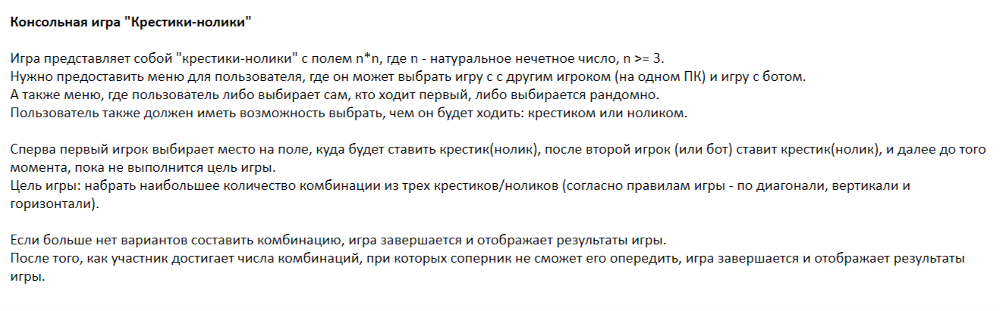

# Tic Tac Toe

Console game "TicTacToe"

***

## Task description ##

The game is a tic-tac-toe with a field `n` * `n`, where `n` is a natural odd number, `n >= 3.`
It is necessary to provide a menu to the user where he can choose a game with another player (on the same PC) or a game with a bot.
And also a menu where the user chooses himself who walks first, or is chosen randomly.
The user should also be able to choose what he will walk with: a `cross` or a `zero`.

First, the first player chooses a place on the field where he will put a cross (zero), after the second player (or bot) puts a zero (cross), and so on until the goal of the game is fulfilled.
Goal of the game: score the largest number of combinations of *three crosses / zeros* (according to the rules of the game - diagonally, vertically and horizontally).

If there are no more options to make a combination, the game ends and displays the results of the game.
After the participant reaches the number of combinations in which the opponent cannot get ahead of him, the game ends and displays the results of the game.

***

## Project status

Project at the stage of algorithm development

## Roadmap

- [ ] [] [Program.cs](TicTacToe/Program.cs#L1)
- [ ] []
- [ ] []
- [ ] []
- [ ] []
- [ ] [request](https://gitlab.com/-/experiment/new_project_readme_content:749681a99ec50baf7f5d1fc12b60ff54?https://docs.gitlab.com/ee/user/project/merge_requests/creating_merge_requests.html)
- [ ] [merge requests](https://gitlab.com/-/experiment/new_project_readme_content:749681a99ec50baf7f5d1fc12b60ff54?https://docs.gitlab.com/ee/user/project/issues/managing_issues.html#closing-issues-automatically)
- [ ] [succeeds](https://gitlab.com/-/experiment/new_project_readme_content:749681a99ec50baf7f5d1fc12b60ff54?https://docs.gitlab.com/ee/user/project/merge_requests/merge_when_pipeline_succeeds.html)